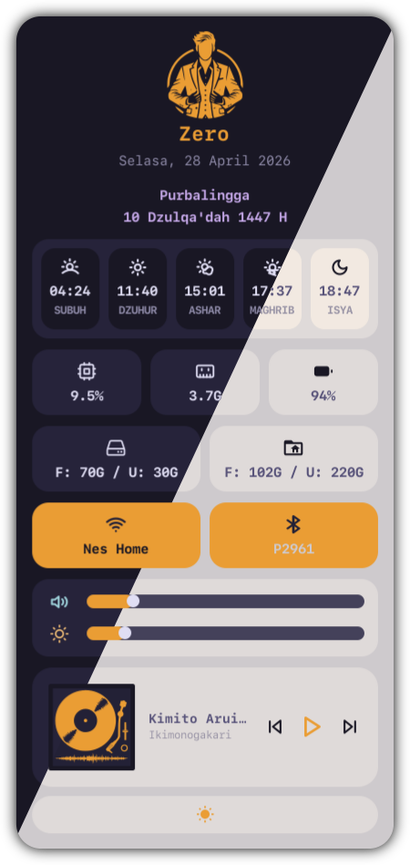

# Simple Widget Control Center Eww



## Dependencies
- pamixer
- iwd
- [langgar](https://gitlab.com/nesstero/langgar)
- xbacklight 

## Run
Move all files to ~/.config/eww
```
$ eww daemon
$ eww open --toggle control_center
```
